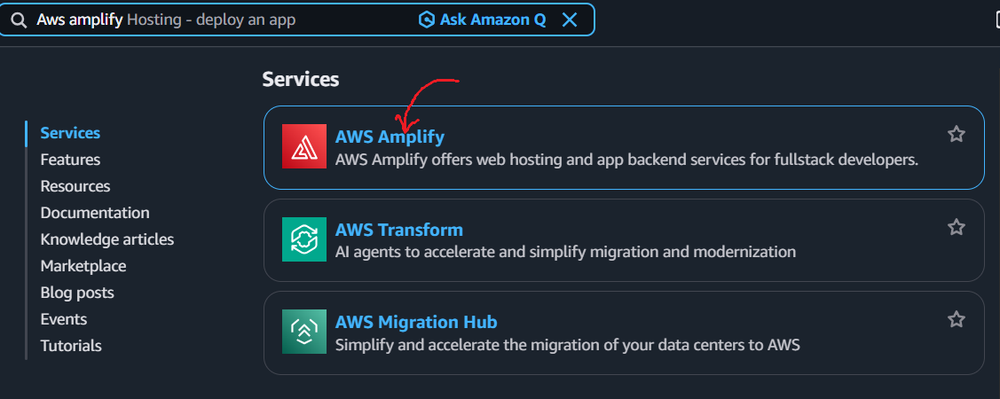
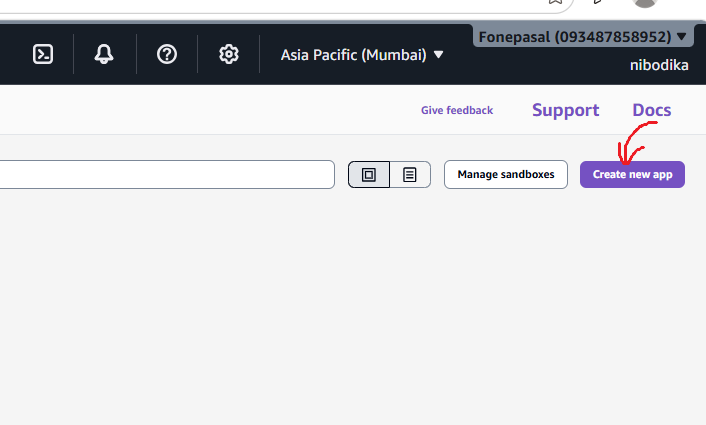
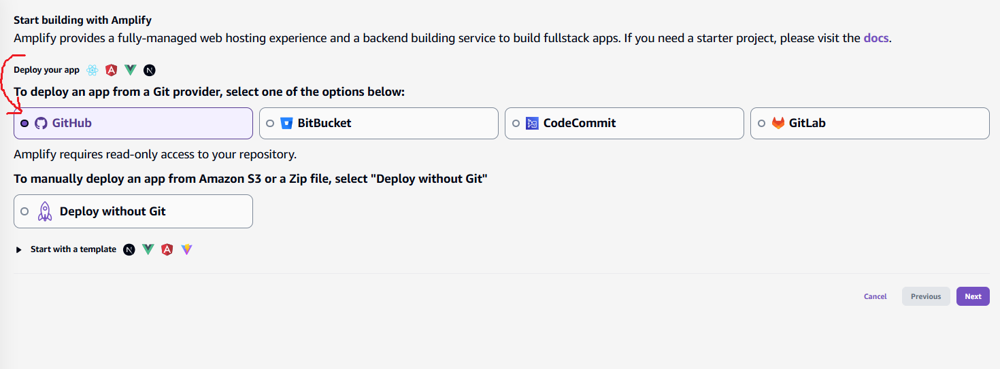
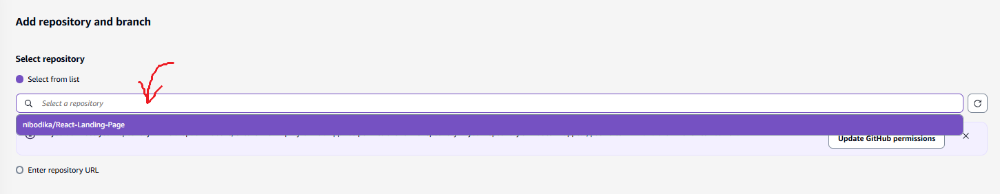
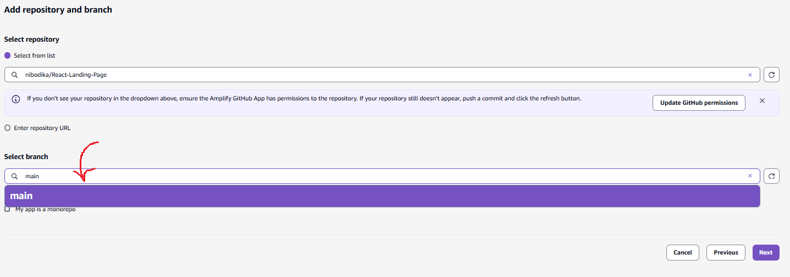
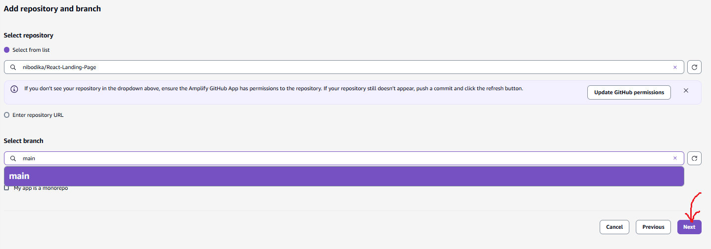
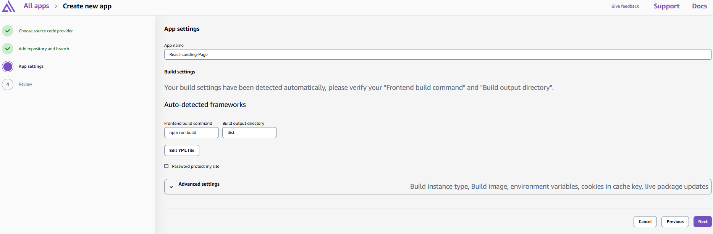
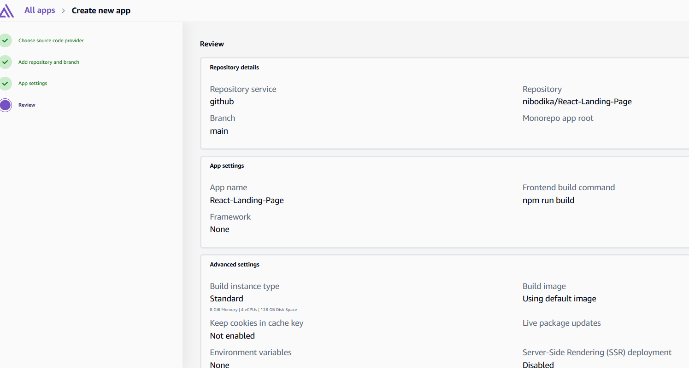
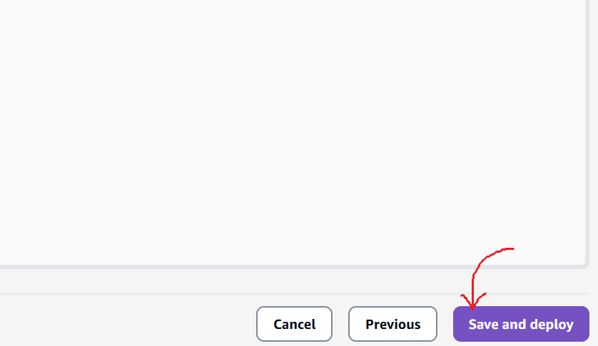

# React Landing Page - AWS Amplify Deployment Documentation

## Project Overview

This document describes the process of building and deploying the **React Landing Page** using **AWS Amplify**, along with troubleshooting steps for common deployment issues.

---

# Project Stack

- React
- Vite
- HTML5
- CSS3
- JavaScript
- Git & GitHub
- AWS Amplify

---

# Project Structure

```
react-landing-page/
│
├── src/
│   ├── components/
│   ├── styles/
│   ├── data/
│   ├── assets/
│   ├── App.jsx
│   ├── App.css
│   ├── index.css
│   └── main.jsx
│
├── public/
├── package.json
├── package-lock.json
├── vite.config.js
└── README.md
```

---

# Step 1: Install Dependencies

Navigate to the project directory.

```bash
cd react-landing-page
```

Install all required packages.

```bash
npm install
```

Output:

```
added 74 packages
found 0 vulnerabilities
```

---

# Step 2: Build the Project Locally

Generate the production build.

```bash
npm run build
```

Expected Output:

```
vite build

✓ built successfully
```

A new folder named **dist/** will be created.

---

# Step 3: Push Project to GitHub

Initialize Git (if not already initialized).

```bash
git init
```

Add all project files.

```bash
git add .
```

Commit the changes.

```bash
git commit -m "Initial Commit"
```

Rename the branch.

```bash
git branch -M main
```

Connect the GitHub repository.

```bash
git remote add origin <repository-url>
```

Push the code.

```bash
git push origin main
```

---

# Step 4: Deploy Using AWS Amplify

1. Open AWS Console.

2. Navigate to **AWS Amplify**.


3. Click **Create App**.


4. Select **GitHub** as the repository provider.


5. Authorize GitHub.

6. Select the repository.


7. Select the branch.


8. Click **Next**.


9. Review the build settings.



10. Click **Save and Deploy**.


Amplify automatically:

- Clones the repository
- Installs dependencies
- Builds the application
- Deploys the production build

---

# Amplify Build Process

Amplify executes the following commands automatically.

Install dependencies:

```bash
npm ci
```

Build application:

```bash
npm run build
```

Publish:

```
dist/
```

---

# Local Verification

Install dependencies.

```bash
npm install
```

Run development server.

```bash
npm run dev
```

Build production version.

```bash
npm run build
```

Preview production build.

```bash
npm run preview
```

---

# Deployment Error Encountered

Amplify build failed with the following error:

```
Could not resolve "../styles/navbar.css"
from
src/components/Navbar.jsx
```

---

# Root Cause

AWS Amplify runs on **Linux**, which uses a **case-sensitive file system**.

Windows is **case-insensitive**, so the project may build successfully on a local Windows machine even when the filename capitalization does not match the import statement.

Example:

Import statement:

```jsx
import "../styles/navbar.css";
```

Actual filename:

```
Navbar.css
```

This mismatch causes the deployment to fail on Linux.

---

# Solution

Ensure that the filename and the import statement match exactly.

Correct Example:

Filename

```
navbar.css
```

Import

```jsx
import "../styles/navbar.css";
```

or

Filename

```
Navbar.css
```

Import

```jsx
import "../styles/Navbar.css";
```

The capitalization must be identical.

---

# Verify CSS Files

List all files inside the styles directory.

Windows:

```powershell
dir src\styles
```

Linux/macOS:

```bash
ls src/styles
```

Verify that every CSS import matches the actual filename.

---

# Git Case Rename (If Required)

Git may not detect capitalization-only changes on Windows.

Rename using Git.

```bash
git mv src/styles/Navbar.css src/styles/temp.css
```

```bash
git mv src/styles/temp.css src/styles/navbar.css
```

Commit the changes.

```bash
git add .
```

```bash
git commit -m "Fix filename casing"
```

Push to GitHub.

```bash
git push
```

Redeploy the Amplify application.

---

# Common Amplify Build Errors

## Module Not Found

```
Could not resolve file
```

Cause:

- Incorrect import path
- Missing file
- Incorrect filename capitalization

---

## npm Install Failed

```
npm ci failed
```

Possible Causes:

- Missing package-lock.json
- Invalid package.json
- Dependency conflict

---

## Build Failed

```
vite build failed
```

Possible Causes:

- Syntax error
- Missing assets
- Missing CSS or JavaScript files
- Invalid import statements

---

## Environment Variable Error

```
Failed to set up process.env.secrets
```

Possible Causes:

- Missing Amplify environment variables
- Missing SSM Parameter Store configuration

---

# Best Practices

- Keep filenames lowercase to avoid case-sensitivity issues.
- Verify import paths before deployment.
- Test the production build locally using `npm run build`.
- Commit all project files before deploying.
- Use Git to rename files when changing capitalization.
- Review Amplify build logs after each deployment.

---

# Useful Commands

Install dependencies

```bash
npm install
```

Run development server

```bash
npm run dev
```

Build production

```bash
npm run build
```

Preview production build

```bash
npm run preview
```

Git status

```bash
git status
```

Add files

```bash
git add .
```

Commit

```bash
git commit -m "Commit message"
```

Push changes

```bash
git push
```

---

# Conclusion

The React Landing Page was successfully built locally using Vite. During deployment to AWS Amplify, the build failed because of a filename case mismatch (`navbar.css` vs `Navbar.css`). Since AWS Amplify uses a Linux environment, filenames are case-sensitive. Correcting the filename or import statement to match exactly, committing the changes, and redeploying resolves the issue.